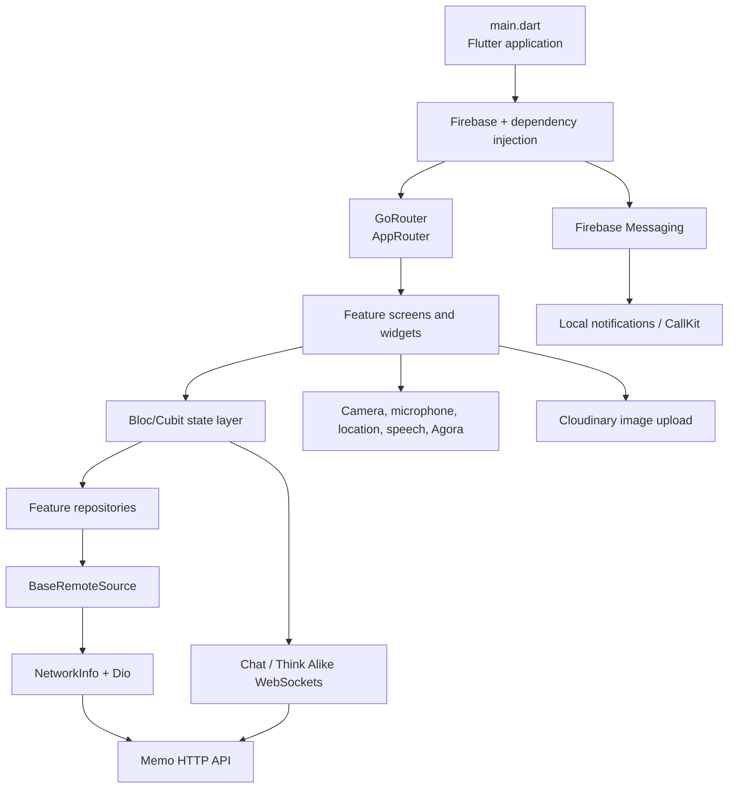
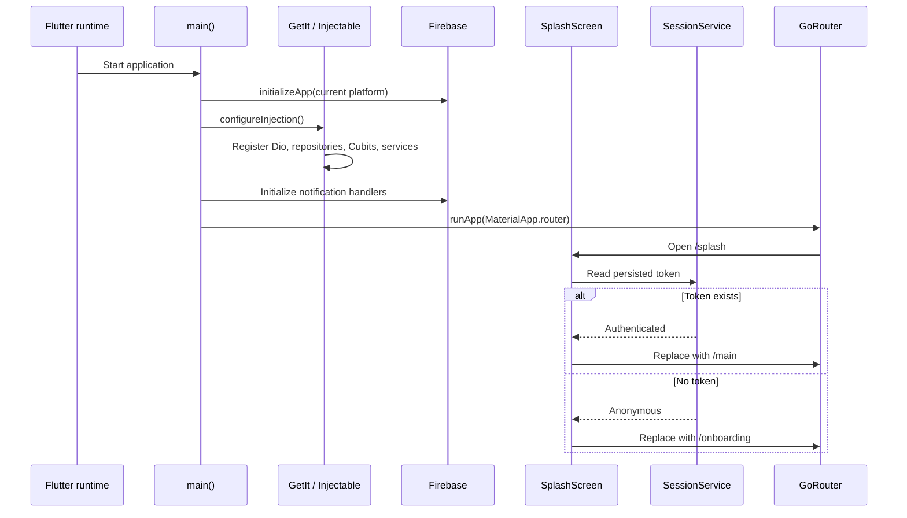

# Memo

Memo is a Flutter social-connection app for building private relationships around profiles, shared memories, conversations, and lightweight games. The current client includes authentication, face verification, connections, matching, chat, video calls, timelines, shared albums, shared bucket lists, notifications, AI chat, and the Think Alike game.

This repository contains the Flutter client. It communicates with a separate HTTP/WebSocket backend and uses Firebase for push notifications.

## What the app does

- Onboards users and supports sign up, OTP verification, login, password recovery, and profile setup.
- Optionally creates and verifies a face embedding for face-assisted authentication.
- Lets users search for people, send/accept/reject connection requests, and view profiles.
- Provides direct chat, AI chat, voice AI, video calls through Agora, call recording, and transcript upload.
- Shows matches and match actions.
- Stores connection-specific timelines, memories, shared photo albums, and shared bucket-list items.
- Sends FCM notifications for chat, calls, and games, with local notification and iOS CallKit handling.
- Includes the Think Alike question/session game and quest/trivia screens.

## Architecture at a glance

The code uses a feature-first structure. Presentation widgets and screens own UI composition; Cubits handle user actions and state; repositories translate application operations into API calls; shared core services provide networking, session storage, routing, notifications, uploads, and platform integrations.



### Startup and session flow



## Repository layout

```text
lib/
├── main.dart                         Application bootstrap
├── firebase_options.dart              FlutterFire platform configuration
├── core/
│   ├── api/                           Shared remote-source request wrapper
│   ├── constants/                     API paths, colors, storage keys, etc.
│   ├── di/                            Injectable/GetIt registration
│   ├── errors/                        API and application error unions
│   ├── network/                       Dio auth interceptor and connectivity
│   ├── routes/                        GoRouter and route names
│   ├── services/                      FCM, notifications, calls, uploads, device APIs
│   ├── session/                       SharedPreferences-backed session data
│   ├── state/                         Reusable API state union
│   ├── theme/                         Theme and text styles
│   └── utils/                         Shared helpers
└── features/
    ├── auth/                           Registration, login, OTP, password recovery
    ├── face_verification/              Camera capture and face API integration
    ├── home/                           Home, profiles, connections, chat, QR scanner
    ├── matches/                        Match feed and swipe actions
    ├── timeline/                       Timelines and memories
    ├── shared/                         Shared albums and bucket lists
    ├── video_call/                     Agora call lifecycle and transcripts
    ├── ai_chat/                        WebSocket AI chat and voice UI
    ├── game/                           Think Alike sessions and gameplay
    ├── notification/                   Notification list and unread count
    ├── profile/                        Profile editing and settings
    ├── quest/                          Quest/trivia UI
    ├── main/                           Onboarding and bottom-navigation shell
    ├── splash/                         Session-aware startup screen
    ├── common/                         Reusable UI components
    └── privacy_policy/                 Legal screens
```

Most feature folders follow this pattern:

```text
feature/
├── data/                 Request/response models and generated serializers
├── repository/           Abstract contract + Dio-backed implementation
├── cubits/               Injectable Cubits for async actions
└── presentation/         Screens, state models, and reusable widgets
```

Some older or smaller features use `domain/repository`, `cubit`, or `model` instead of the exact names above. The architectural responsibility is the same.

## State and data flow

Remote operations return a `dartz` `Either`: the left side is an `AppError`, and the right side is an `ApiResponse<T>` or paginated response. Cubits convert those results into `BaseApiState` values for the UI.

```mermaid
flowchart LR
    UI[Screen / widget] -->|user action| C[Cubit]
    C --> R[Repository interface]
    R --> B[BaseRemoteSource.networkRequest]
    B --> Check{Internet available?}
    Check -->|no| NoNet[AppError.noInternet]
    Check -->|yes| D[Dio request]
    D --> I[AuthInterceptor adds Bearer token]
    I --> Server[Memo backend]
    Server --> Parse[Parse JSON into Freezed models]
    Parse --> Right[Either.right(ApiResponse)]
    NoNet --> Left[Either.left(AppError)]
    Right --> C
    Left --> C
    C --> State[initial / loading / success / error / validation / noInternet]
    State --> UI
```

`BaseRemoteSource` centralizes connectivity checks and converts Dio/API failures into application errors. `SessionService` stores the token, user ID, onboarding flag, theme, and role in `SharedPreferences`. `AuthInterceptor` reads the token immediately before requests and adds `Authorization: Bearer <token>` when a session exists.

## Main navigation

The initial route is `/splash`. Authenticated users are sent to the main shell, whose bottom navigation contains Home, Matches, Search/Add Connection, and Settings.

```mermaid
flowchart TD
    Splash[/splash] --> AuthCheck{Saved token?}
    AuthCheck -->|No| Onboarding[/onboarding]
    AuthCheck -->|Yes| Main[/main]
    Onboarding --> Login[/login]
    Onboarding --> Signup[/sign-up]
    Login --> FaceLogin[/login-face-verification]
    Login --> Main
    Signup --> Verify[/verify-token]
    Verify --> SetProfile[/set-profile]
    SetProfile --> Main
    Main --> Home[Home / connections / chat]
    Main --> Matches[Matches]
    Main --> Search[Add connection / QR scanner]
    Main --> Settings[Settings / profile]
    Home --> Timeline[/time-line]
    Home --> Album[/sharedAlbum]
    Home --> Bucket[/sharedBucketList]
    Home --> Call[/video-screen]
    Home --> Voice[/voice]
    Home --> Notifications[/notifications]
```

Additional registered routes cover face verification, forgot/reset password, user profiles, quests, Think Alike partner sessions, legal pages, and the video-call surface. Route arguments are passed through `GoRouterState.extra`; examples include `ProfileRequestModel`, `ConnectionResponse`, `TimeLineScreenParams`, `VideoCallPageParams`, and `ThinkAlikePartnerArgs`.

## Backend and integrations

The endpoint catalog lives in [`lib/core/constants/api_endpoints.dart`](lib/core/constants/api_endpoints.dart). It currently covers:

| Area | Examples |
| --- | --- |
| Authentication | registration, OTP activation/resend, login, password recovery, FCM device token |
| Connections | users, search, connection requests, chat history, location |
| Social content | profiles, recent images, memories, timelines, matches |
| Shared content | shared albums and shared bucket lists |
| Calls | Agora token, start/end call, transcript upload |
| Face verification | create embedding, verify face, verification status |
| Notifications | list and unread count |
| Think Alike | questions, sessions, accept, answer, reveal, cancel |

External/platform integrations are implemented in `lib/core/services` and feature repositories:

- Firebase Core and Firebase Messaging for push notifications.
- Flutter Local Notifications for foreground/background presentation.
- Flutter CallKit Incoming for incoming-call UI.
- Agora RTC Engine for video calls.
- Cloudinary for profile/image uploads.
- Camera, Google ML Kit face detection, microphone recording, speech-to-text, text-to-speech, geolocation, and device information plugins.

## Configuration notes

Before running the app, verify the following source-controlled configuration:

- `lib/core/di/register_modules.dart` currently points Dio at `http://10.170.41.138:4000/v1/`.
- `lib/features/ai_chat/cubits/ai_chat_cubit.dart` currently connects to `ws://10.170.41.138:4000/v1/aiChat/<connectionId>`.
- `lib/firebase_options.dart` has Android and iOS Firebase options. Web, macOS, Windows, and Linux intentionally throw `UnsupportedError` until configured with FlutterFire.
- `lib/core/constants/cloudinary_constants.dart` contains the current Cloudinary cloud name and unsigned upload preset.
- Native permissions and capabilities must be configured for camera, microphone, location, notifications, recording, and calls on the target platform.

For a production build, move environment-specific HTTP/WebSocket hosts and third-party configuration out of source code and provide separate development, staging, and production values.

## Getting started

Prerequisites:

- Flutter SDK compatible with Dart `^3.10.7`.
- A configured Android or iOS toolchain.
- Access to the Memo backend at the configured HTTP/WebSocket addresses.
- Firebase project configuration for the target platform.

```bash
flutter pub get
dart run build_runner build --delete-conflicting-outputs
flutter analyze
flutter test
flutter run
```

`build_runner` regenerates the `*.freezed.dart`, `*.g.dart`, and Injectable registration files. Do not edit generated files manually. During development, use:

```bash
dart run build_runner watch --delete-conflicting-outputs
```

To build a platform package after platform-specific setup:

```bash
flutter build apk
flutter build ios
```

## Adding a feature

1. Add request/response models under the feature's `data` directory. Use Freezed/JSON annotations when the model is serialized.
2. Define a repository contract and implement it with `BaseRemoteSource` and `ApiEndpoints`.
3. Add an `@injectable` Cubit that maps repository results to a state, normally `BaseApiState<T>`.
4. Add screens and widgets under `presentation`.
5. Register a route in `AppRoutes` and `AppRouter` when the feature needs navigation.
6. Run code generation, formatting, analysis, and tests.

## Current implementation caveats

- The app is primarily wired for Android and iOS; other platform Firebase options are not configured.
- The backend host is a private network address, so the default build will not work outside the configured network unless the host is changed.
- The app has both HTTP APIs and WebSocket flows; connectivity checks in `BaseRemoteSource` do not replace handling disconnects in Cubits such as `AiChatCubit`.
- Some route constants exist for planned or partially wired screens; the authoritative list of active routes is the `routes` list in `lib/core/routes/app_router.dart`.
- Generated files are committed in the repository and should be regenerated whenever annotated models or injectable classes change.

## Useful entry points

- [`lib/main.dart`](lib/main.dart) — application startup and top-level providers.
- [`lib/core/di/register_modules.dart`](lib/core/di/register_modules.dart) — Dio and infrastructure configuration.
- [`lib/core/routes/app_router.dart`](lib/core/routes/app_router.dart) — active navigation graph.
- [`lib/core/api/base_api_response.dart`](lib/core/api/base_api_response.dart) — shared request/error pipeline.
- [`lib/core/session/session_service.dart`](lib/core/session/session_service.dart) — persisted session state.
- [`lib/core/constants/api_endpoints.dart`](lib/core/constants/api_endpoints.dart) — backend endpoint catalog.
